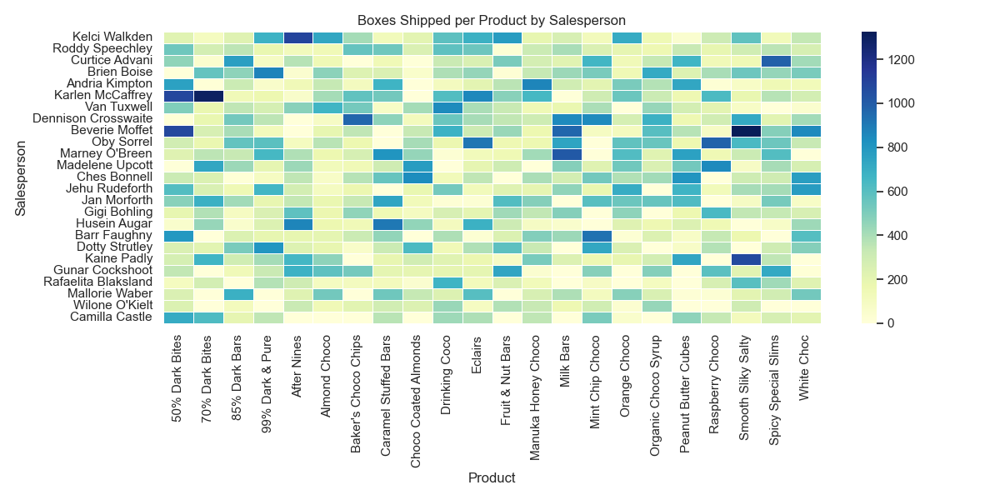
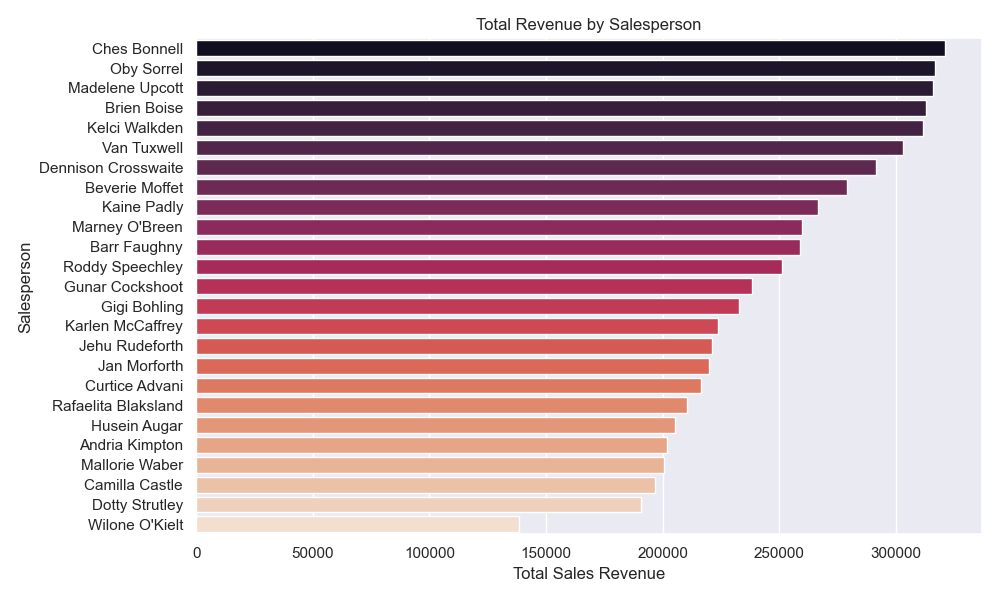
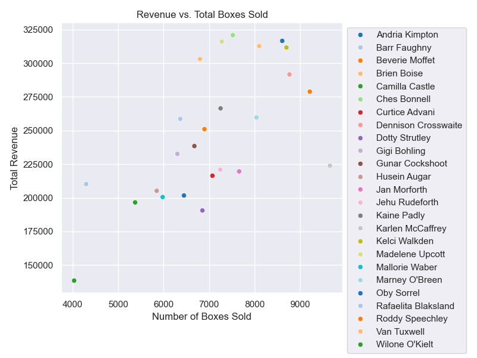

# Chocolates: Sales Analysis

## Objective
To analyze chocolate sales data to uncover insights into salesperson performance. In this project, I aim to: 
- Examine pricing consistency across products to see if all customers are charged the same rates.

- Assess the diversity of each salesperson's product mix and its potential impact on revenue.

- Evaluate and compare individual performance, considering both volume and pricing strategy.

## Tools and Technologies used
- Python
- Pandas
- Seaborn & Matplotlib
- Scipy
- Plotly

## Dataset
This dataset I used contains records of 8 months worth of chocolate sales, detailing revenue, sales quantity, sales region and type of products, stored in CSV format.

Columns:
1. Sales Person: The name of the sales person in charge of the sale
2. Country: The name of the country where the sale was processed.
3. Product: The name of the product 
4. Date: The date of the sale
5. Amount: The revenue made from this sale
6. Boxes Shipped: The quantity of boxes sold in this sale

Link: https://www.kaggle.com/datasets/atharvasoundankar/chocolate-sales/data 

## Cleaning the dataset
- Renamed Amount to Revenue, reformatted it and changed type to integer
- Converted Date to datetime format

## Exploratory Data Analysis

### Key Insights
- Product prices are not fixed, as revenue per box varies for the same product. This could be influenced by tariffs, inflation, discounts, and price customisation by the sales person.

- All salespersons sell over 70% of the products, suggesting that salespeople have flexible product assignments

- The top 3 salesperson sells 20 out of 22 of the products.

### Visualisation

 
 
 This heatmap highlights the distribution of product sales across salespeople, with some individuals specializing in certain products and others showing broader coverage.

This barchart shows the total revenue brought in by each sales person. 

This scatterplot shows a positive correlation between a salesperson's product range and the total revenue they bring in. This suggests that the more variety of products a sales person sells, the more revenue they bring in. 

This scatterplot shows a positive correlation between the number of boxes a salesperson sells and the revenue they bring in. This suggests that salespeople who sell more boxes tend to generate more revenue.

This scatterplot shows a positive correlation between the number of boxes a salesperson sells and their product range. This suggests that those selling a broader variety of products also sell more boxes overall. 

## Conclusion
This analysis reveals strong positive relationships between product range, number of boxes sold, and total revenue—suggesting that versatility in product sales contributes to better performance. While pricing inconsistencies hint at possible regional or strategic variations, the overall data shows that broader product engagement may be a key driver of sales success.